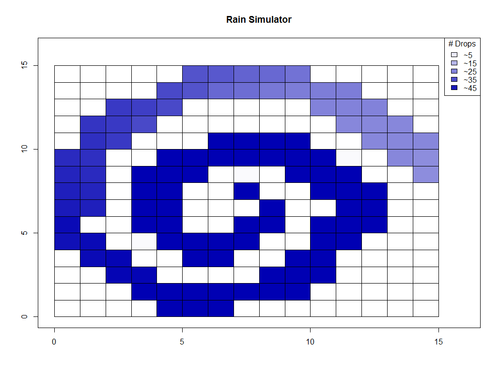

A storm of 1 million gallons begins with 1 drop!

SUMMARY: Hello! This is my first project (built for fun!). It simulates rain drop diffusion across tiles. By slowing down the rate of diffusion, I can draw different shapes or words before I increase the rate of diffusion to make the image dissipate into equilibrium.  

HOW TO RUN IT: Just fork and clone the repo and run the entire code. Then sit back and watch the different shapes you'll see it begin with a *SECRET* word, maze, uppercase sigma, and spiral.  

MOTIVATION: On day, my good friend asked me, "Oh whatever shall I do for my data science project? My professor gave me only 2 instructions: program something and use statistics." I proposed that we simulate rain landing on tiles because it sounded like a cool idea we learned about the Poisson Distribution in Probability (stat 134). Then she told me, "Oh but Eugene. That's a great idea! But it's not reality--I don't want to program something so complex." Hence, out of my own curiosity, I programmed this Rain Simulator nonstop over the free time I had--the 3 days of Thanksgiving break. My mom, with her clear-headedness, asked me, "What in the world are you doing during Thanksgiving break?" Upon telling her that I was programming a rain simulator, she told me she didn't want to see it... Upon telling me friend how this program works and sending her the code, she was ecstatic. She told me, "Thanks!" and explained she'll use the code for sports analysis. Little did I know later, she turned it in as a semester Final Project and received an A. I was not angry but rather flattered. She later bought me dinner.  

CHALLENGES: I had never written much extensive R code (even during class because the problems tend to be solved, canned questions). I myself had no idea how to begin, and I never imagined that the code would be this complex. Since it was my first REAL project, the code is not super ideal, but it runs with the sufficiently readable documentation. This project took no less than 8 helper functions to build the matrix that I turned into a heatmap. The heatmap shows how rain dissipates over time.  
1) HEATMAP: It took me a long time to figure out how to draw the heatmap quickly, such that it would look like animation. I initially actually drew boxes sequentially (as if I were writing; left to right, up to down) until I covered the plot. This method took too long and hence would not look like animation.  
2) "Dual Simultaneity-Bias Problem": I just made this term up, but the dual problem is truly one and the same. 1) How can I simultaneously move water drops to adjacent tiles for all tiles? In real life, rain on different tiles diffuse simultaneously; they don't *wait* for diffusion to happen to tile (t-1) to finish first. How can I mimic concurrency when I'm programming sequentially? 2) Where should I BEGIN moving raindrops? If I start at the left-hand corner, then move water drops rightwards and downwards, then there is a certain bias for more rain drops to move right wards and downwards. If I started at the bottom-right corner, I would have the same problem but in reverse.
This Dual Problem took me awhile to solve. I hadn't taken Physics 7A at Berkeley, so grappled with it the longest.  
3) DIFFUSION RATE: Suppose I solved the previous 2 problems, how can I mimic real life where if there is a greater difference in density between 2 adjacent tiles, then there will be more flow between those 2 areas. Basically, I want to mimic a gradient calculation where high density flows to low density quicker (than low density to slightly lower density).  

SOLUTIONS:
1) HEATMAP: I found out the image() function that would make the heatmap of a matrix. I added the legend to show how much rain was in each cell. It plots FAST! A corrolary of this problem requires that I have to spread rain to tiles that exist on the plot; rain cannot fall off the plot! All the rain is conserved within the grid. Hence, I had to manually write an algorithm that tests the *existence* of an adjacent tile to determine whether rain can move in that direction. Had to test the edge cases of tiles on the edges and corners.

2) Dual Simultaneity-Bias Problem: It took me the longest to solve this problem. My makeshift solution is the following: I create 2 time periods: small time and big time. Big time is the time between when raindrops are allowed to fall. In my simulation, you can think of rain following only once per second. Small time is multiple smaller intervals within big time. If 1 big time is 1 second, then 1 small time is a microsecond; there are many small times within 1 big time. During each small time, I allow a very small amount of rain to diffusion to adjacent tiles (I call it an epsilon amount of rain). Hence, during 1 big time, there may be 1000 small time where during each small time, I'm allowing a very small amount of rain diffuse. With this scheme, I am able to reduce bias and simulate simultaneity effectively! 
3) How can I essentially calculate gradient without calculating the gradient? I have to spread raindrops in all 8 adjacent tiles where tiles with a larger imbalance of rain will receive disproportionately more rain. The algorithm I designed was given a tile, look at (up to) 8 adjacent tiles. Find the rain in those adjacent tiles and get the mean. Then, looking into my given tile, find how much extra compared to the mean (current_tile_rain - avg_rain_on_adjacent_tiles = excess_rain). Divide excess_rain by small and big time (because we don't want to move all the rain at once), so you now have epsilon rain (excess_rain / rate1_small_time / rate2_big_time). You diffuse epsilon rain to adjacent tiles using (current_tile_rain - adjacent_tile_rain) / sum(current_tile_rain - adjacent_tile_rain). With this vectorized, you should be able to distribute epsilon rain properly. All this using middle school math; no calculus or trig required!

NOTES:
DIFFUSION RATE: By increasing rate1 relative to rate2, that means you are allowing less diffusion--smaller number of small time per big time. Visually, you are increasing the viscosity of the rain, so wherever the rain lands, it will stay. This is useful drawing pictures. The reverse is where you increase the diffusion rate. Visually, this means that water is reaching equilibrium among adjacent tiles faster--the grid is equally saturated. You let your picture wash away into equilibrium.
SHAPES: The shapes and letters are hard-coded. However, the grid is any n by n grid, so you can draw any shape that the grid can support. In this case, a 15 by 15 grid is sufficiently large to draw complex shapes.

UPGRADE: I added the feature to place "rocks" where rain cannot go. Hence, the maze and spiral shapes are created by allowing rain to fall on a restricted number of tiles (1 and 2 respectively). Where the magic truly happens is placing a set of rocks that "fences" in the rain. Hence, you can think of the rain source as almost a fountain, and the rocks as the riverbed that directs the flow.
